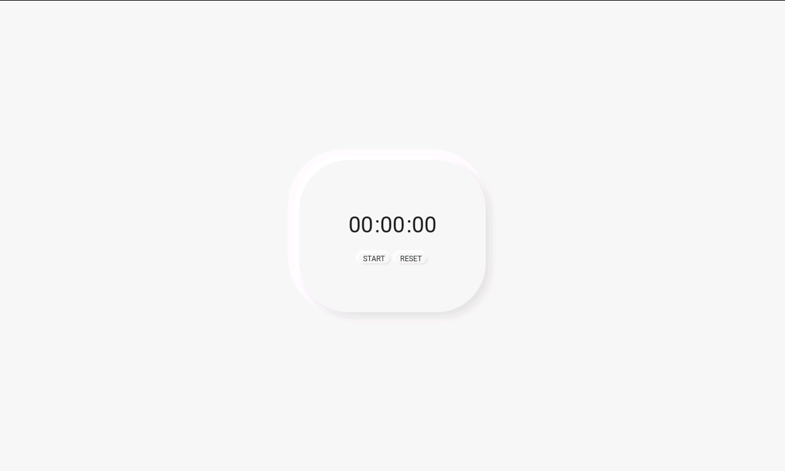
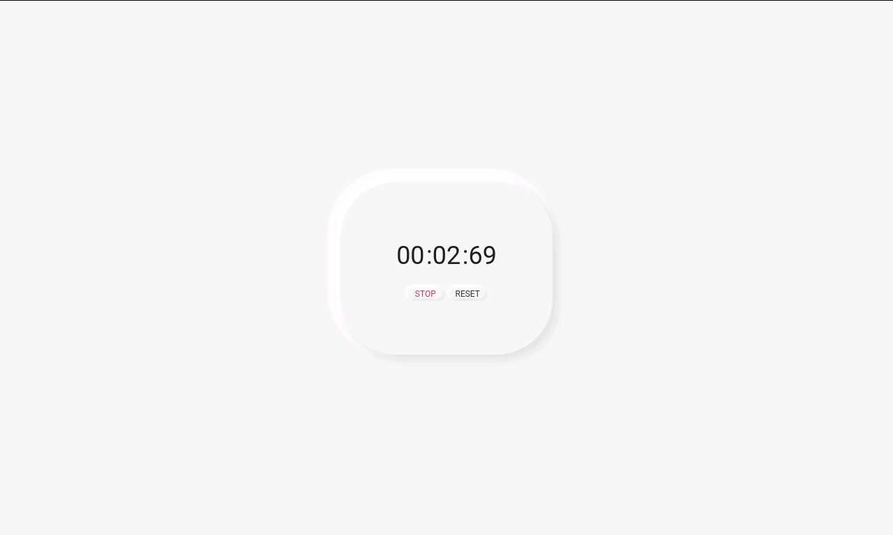

<p align="center">
    
</p>

<p align="center">
  

  

  <a href="https://github.com/joel-fragoso/stopwatch/commits/master">
    
  </a>

  <a href="https://github.com/joel-fragoso/stopwatch/blob/master/LICENSE">
    
  </a>
</p>

<hr />
<p align="center">
  <a href="#projeto">Projeto</a>&nbsp;&nbsp;|&nbsp;&nbsp;
  <a href="#tecnologias">Tecnologias</a>&nbsp;&nbsp;|&nbsp;&nbsp;
  <a href="#como-usar">Como usar</a>&nbsp;&nbsp;|&nbsp;&nbsp;
  <a href="#licença">Licença</a>
</p>
<hr />

## Projeto

O Stopwatch é um cronômetro digital desenvolvido com HTML5, CSS3 e Vanilla JS utilizando a estrutura CSS BEM (Block__Element--modifier).

<p align="center">
    
    
</p>

## Tecnologias

Este projeto foi desenvolvido com as seguintes tecnologias:

- [HTML5](https://www.w3schools.com/html/)
- [CSS3](https://www.w3schools.com/css/)
- [BEM](https://css-tricks.com/bem-101/)
- [Vanilla JS](http://vanilla-js.com/)

## Como usar

Para clonar e executar esta aplicação, você vai percisar do [Git](https://git-scm.com) e do seu Browser.

### Clonando o Projeto
```bash
# Clonar deste repositório
$ git clone https://github.com/joel-fragoso/stopwatch.git
```

### Executando o projeto
```bash
# Entre na pasta stopwatch
$ cd stopwatch

# E clique no arquivo index.html para abri-lo no Browser
$ index.html
```

## Licença

Este projeto está sobre a licença do MIT.<br />
Clique aqui [LICENSE](LICENSE) para mais informações.

<hr />

Feito ❤️ por Joel Fragoso 👋️ [Entre em contato](https://www.linkedin.com/in/joel-fragoso-0906611a9/).
